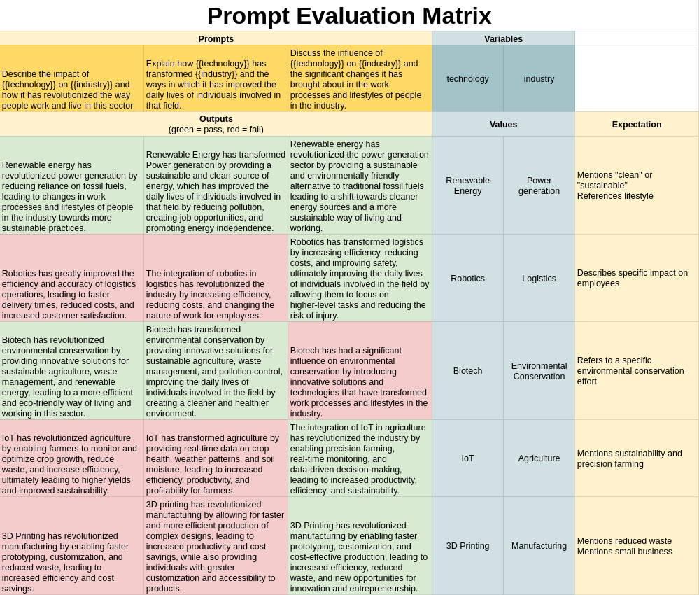

# Intro

`promptfoo` helps you tune LLM prompts systematically across many relevant test cases.

With promptfoo, you can:

- **Test multiple prompts** against predefined test cases
- **Evaluate quality and catch regressions** by comparing LLM outputs side-by-side
- **Speed up evaluations** with caching and concurrent tests
- Use as a command line tool, or integrate into your workflow as a library
- Use OpenAI models, open-source models like Llama and Vicuna, or integrate custom API providers for any LLM API

promptfoo works by producing matrix views that allow you to quickly review prompt outputs across many inputs.

Here's an example of a side-by-side comparison of multiple prompts and inputs. You can manually review outputs, or set up "expectations" that automatically flag bad outputs:

It works on the command line too.

## Workflow and philosophy

[Serious LLM development requires a systematic approach to prompt engineering](https://www.ianww.com/blog/2023/05/21/prompt-engineering-framework). Promptfoo streamlines the process of evaluating and improving language model performance.

The goal: **test-driven prompt engineering**, not trial-and-error.

1. **Define test cases**: Identify core use cases and failure modes. Prepare a set of prompts and test cases that represent these scenarios.
2. **Configure evaluation**: Set up your evaluation by specifying prompts, test cases, and API providers.
3. **Run evaluation**: Use the command-line tool or library to execute the evaluation and record model outputs for each prompt.
4. **Analyze results**: Set up automatic requirements, or review results in a structured format/web UI. Use these results to select the best model and prompt for your use case.

As you gather more examples and user feedback, continue to expand your test cases.

### Example

Using promptfoo, we evaluate three prompts describing the impact of specific technologies on various industries. We substitute several example (technology, industry) pairs, generating a matrix of outputs for side-by-side evaluation.

Each output is graded based on predefined expectations. The results show that Prompt #3 satisfies 80% of the requirements, while Prompts #1 and #2 meet only 40%.

This technique can be applied iteratively to continuously improve prompt quality across diverse test cases.

